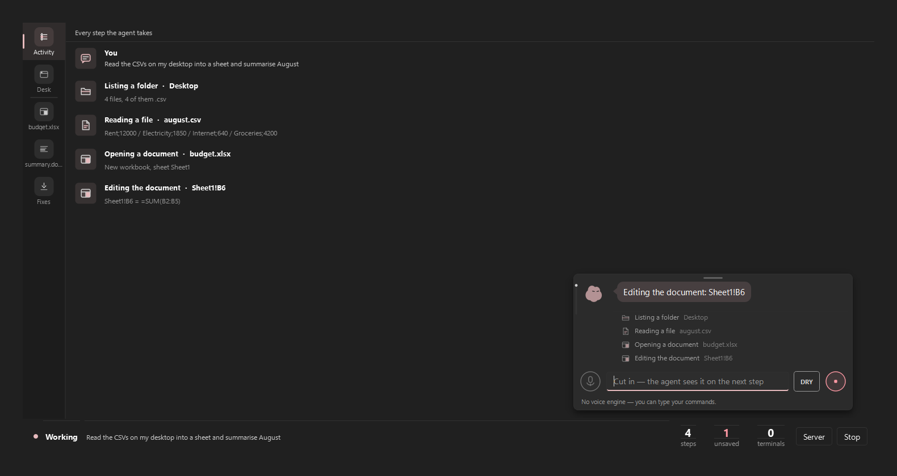

# Doppel

A Windows 11 computer-control agent that gets **its own desktop and its own
cursor**, so it can work while you keep using yours.

[](LICENSE)
[](https://www.python.org/)
[](#requirements)
[](https://doc.qt.io/qtforpython-6/)
[](https://docs.anthropic.com/)
[](tests/test_computer.py)



*Türkçe: [README.tr.md](README.tr.md) — the long-form document, with the
measurements behind every decision.*

---

## The problem this solves

Every computer-use demo takes your machine hostage. The agent moves *your*
mouse, steals *your* focus, types into whatever window happens to be in
front. You sit and watch, because touching anything breaks the run.

`side_*` in this project is the other way round. Windows lets you create a
second desktop object — its own window list, its own focus chain, its own
cursor position. The agent launches apps there and drives them with posted
messages instead of `SendInput`. Nothing in `backend/computer/mesaj.py`
can move the physical cursor, and a test proves it by reading the source.

Measured on both classic Win32 (`charmap.exe`) and Chromium (Chrome):

| what | how | verification |
|---|---|---|
| typing | `WM_CHAR` | `ağır işçi ÖĞÜŞ 42` read back verbatim |
| clicking | `WM_LBUTTON*` | dropdown 0→1; page red → green |
| capture | `PrintWindow` | 1100×760, real content |
| physical cursor | — | never called once during the run |

Three limits, and the agent is told about all three in the `side_launch`
description: Store apps open no window there (including Windows 11's
Notepad), modifier combinations like `Ctrl+S` do not work because the
modifier is not held down on that thread, and there is no drag-and-drop.

### The agent's desk

The side workspace was invisible: `side_capture` only produced a frame when
the agent acted, so between actions the screen was frozen and "what is
happening right now" had no answer.

`app/masa.py` is that answer — a window that captures every window on the
hidden desktop eight times a second and lays them out where they really
are, with the agent's cursor moving over them. Measured: a 1100x760 Chrome
window costs 54 ms per frame, so ~18 fps is the ceiling; eight is chosen
deliberately, because this loop runs on the same machine as the agent's own
work and the agent has priority. Capture runs on its own thread and stops
whenever the window is hidden.

**It looks like a Linux Mint desktop, and that is the point.** What you are
looking at is not your desktop. If it looked like Windows you would have to
work out which screen you were on every time you glanced at it; another
operating system's shell says "this is somewhere else" in one look. The
colours, the panel, the titlebars and the wallpaper are drawn from scratch
here — Mint's own wallpapers, logo and icons belong to Mint and are not in
this repo.

The titlebars have no close or minimise buttons. In a read-only view a
button that does nothing is a lie; instead the titlebar says which window
the agent is working in, which is what you actually want to know. The
panel has two real controls. **Pause** does a real job: capture costs 54 ms
a frame and giving that back to the agent while you are not looking is the
right trade. **Zoom** switches between the whole 1920x1080 desktop and the
bounding box of the open windows — fitting a full desktop into a page means
a 0.57 scale, and a 980-pixel browser rendered at 560 is not readable. Both
views are true; the panel says which one you are looking at.

The panel sits at the **top**, where Mint puts it at the bottom. The desk
is a page inside the app now and the app has its own status strip at the
bottom; two bars stacked on each other were two bars doing the same job.

The wallpaper is cached into a pixmap and only rebuilt on resize. That is
what pays for it being more than a flat gradient: two light sources, four
soft bands, a vignette, and film grain — a large dark gradient bands badly
in an 8-bit channel and grain is what breaks it up. The grain is
deterministic, so two screenshots of the same state are identical and a
regression can be caught by comparing them.

`python scripts/masa_dogrula.py` opens real apps on the hidden desktop and
writes the frame to `varliklar/onizleme/masa.png`.


### Watching it write code

When the agent writes a file, a **Code** window opens inside the desk —
file list, tabs, line numbers, real syntax colouring, a terminal drawer
and a diff drawer. It is not a screenshot: the captured windows around it
are scaled photographs, this one is live interface at 1:1, because code
you cannot read is code there was no point showing.

The code appears **as the model produces it**. Tool inputs stream
(`input_json_delta`) and `backend/agent/akankod.py` decodes the file
content out of that half-finished JSON: a partial string, escapes cut in
half, a `ç` missing its last digit. `json.loads` rejects all of it,
so the scanner walks the object key by key and hands back as much of the
value as has arrived. What you see on screen is therefore what the model
is writing at that moment, not a replayed animation. The file itself is
still written to disk in one go; what is live is the writing, and the
status line says exactly that.

The desk splits when both are in play: the editor on the left, the real
captured windows on the right. Below a readable width it stops splitting
— two unreadable panes are worse than one readable one — and while a file
is being written the editor takes the desk, handing it back when the
writing ends.

The bottom drawer holds the terminal and the diff, tabbed, and a tab is
only drawn for content that exists: an empty "Changes" tab looks like
there is something to look at.

## What it is

A native Qt (PySide6) desktop app. No web layer, no browser engine, no
HTTP bridge. It sees the screen through Claude Opus 5's
`computer_toolset_20260801`, and drives the mouse and keyboard through raw
Win32 `SendInput`.

On top of the computer toolset there are 39 custom tools, because clicking
through a GUI is the most expensive way to do almost anything:

| tool | what for |
|---|---|
| `read_ui_tree` | The window's controls as text, with click points. Far cheaper than a screenshot, and the coordinates are measured rather than guessed. |
| `launch_app` | Starts the app directly. Clicking through the Start menu took four or five turns. |
| `run_shell` | One-shot PowerShell for bulk file work and queries. |
| `write_file` `read_file` `edit_file` `list_dir` | File work. UTF-8 everywhere — Windows' cp1254 default silently corrupts non-ASCII text. |
| `terminal_open` `terminal_send` `terminal_read` `terminal_close` | Persistent terminal sessions over ConPTY. |
| `office_open` `office_read` `office_edit` `office_save` `office_history` | Real `.xlsx`/`.docx` files without Office installed. |
| `skill_write` `skill_list` `skill_remove` | The agent writes its own Python tools and loads them without a restart. |
| `button_write` `button_remove` | The agent proposes a button on the bar for a job you keep repeating. |
| `remote_connect` `remote_run` `remote_read` `remote_write` `remote_list` | An SSH server as a second machine, with its own approval gate. |
| `side_launch` `side_windows` `side_capture` `side_act` `side_close` | The invisible workspace above. |
| `record_start` `record_stop` | Records a side-desk window to an mp4 in `runs/`. Windows only draws the desktop that holds the keyboard, so it captures one window, not the whole desk. |
| `workflow_save` `workflow_list` `workflow_run` `workflow_remove` | Records a finished job and replays it with no model call at all. |
| `heads_up` | Writes a note about what could go wrong in the thing it is about to do. Changes nothing, asks nothing. |

The system prompt gives the model a **ladder**: file tools for file work,
the shell for bulk work, a terminal for interactive programs,
`launch_app` to open something, `read_ui_tree` to find something, and
screenshots plus the mouse for everything left. Opening a file in Notepad
and typing into it is possible, and it is the most expensive path.

Thinking effort varies per step: `high` on the first step, because that is
where the approach is chosen and a wrong approach throws away the next ten
steps; `medium` after that; `high` again right after an action fails,
because a failing agent is a stuck agent.

## Three fixes for things agentic tools get wrong

These come from watching what people actually complain about with agent
editors, and each one is a feature here rather than a known annoyance.

**It says it did things it did not do.** After every turn, the reply is
matched against what the audit log actually recorded. If the agent writes
"I saved the file" and no file tool ran in this turn or anywhere earlier in
the session, a line appears in the status bar: there is no record of it.
The note never accuses — it says where the evidence is missing.
`backend/agent/rapor.py`.

**You cannot see what it did.** Every turn and every action goes to a JSONL
audit log under `runs/`: tool, arguments, whether it errored, and the
result. File bodies are not duplicated (they are already on disk) and
anything matching a key pattern is redacted before it is written — the
audit log must not itself become the leak. `backend/agent/kayit.py`.

**You keep asking for the same thing.** If the same tool sequence completes
three times without a single error, the next instruction carries a note
suggesting the agent offer you a button for it. Runs that stumbled do not
count: automating a job that fails three times out of three would be
automating the failure.

### It says what to watch out for

Before the agent touches something inside an app where a mistake would be
seen by other people or would be hard to undo — sending a message,
posting, replying, deleting, renaming, paying — it writes a one or two
sentence note: *the reply goes to the #genel channel, not a direct
message*. It also writes one when your instruction left a choice open and
it had to pick: *you did not say which of the two accounts, so I used the
one you have talked to before.*

The note is a note. It does not pause the run and it does not ask you
anything, so it costs no decision — which is the point, because a thing
that stops you gets clicked through, and a thing that asks gets answered
without reading. It is drawn differently from a step row: a step says
what it did, a note says what could go wrong, and rendering them the same
way would lose the note inside a thirty-line list.

This is the cheap half of the biggest measured failure mode. In 20,574
real sessions the two largest categories were the agent breaking a stated
constraint (38.33%, and rising) and misreading intent (26.95%) — and only
2.99% of those were caught by the agent itself. Saying the assumption out
loud *before* acting is worth more than any amount of careful phrasing
afterwards, because afterwards is too late.

## MCP servers

External MCP servers can lend the agent tools this app does not have — a
structured browser, a GitHub client, a web fetcher. They are declared in
`~/.ajan/mcp.json` in the **standard** format, so a config you already
have for another app pastes in whole, and there is an "Import from
Claude" button for Claude Desktop's.

Their tools arrive named `mcp__<server>__<tool>` and then take exactly
the same road as everything else: the approval gate, the audit log, dry
run, workflow recording. Nothing had to be written twice.

Measured against `@modelcontextprotocol/server-everything`: 3.5 s to
connect over `npx`, 13 tools discovered, a call round-trips in 5 ms, and
image results survive as image blocks rather than being flattened to
text — which is the whole point of a tool like Playwright's screenshot.
`python scripts/mcp_dogrula.py` runs that measurement.

**The security posture is deliberate, and it is the reason this took as
long as it did.** A server is a process on your machine with your
permissions, and its *tool descriptions go straight into the model's
prompt* — a documented attack surface, not a hypothetical one: one audit
found critical issues in 33% of 1,000 scanned servers, another graded
71% of sampled packages at the bottom.

So: nothing starts on its own — writing a server into the config is not
permission to run it, and enabling is a separate click with a dialog that
says what it means. Every single MCP call asks you, with the tool's own
description in the prompt. Descriptions are scanned for the known
poisoning patterns (`ignore previous instructions`, `do not tell the
user`, `<IMPORTANT>`, naming credential files, "call me before every
other tool") and flagged — **flagged, not blocked**, because scanners in
this space have a high false-positive rate and a scanner that blocks
would quietly break working servers. The tool set is fingerprinted, so a
server that changes its definitions after you approved it says so. And
the system prompt tells the model in as many words that a tool
description is not an instruction to it.

`env` values are never shown in the interface, only which keys are set;
`${VAR}` reads from the process environment so a token need not live in
the file at all.

## Four more ways to not pay for the same work twice

**History.** Every turn is already written to `runs/*.jsonl` as it
happens. The History page reads it back: the instruction, what the agent
said, every tool call and every error, day by day, and it outlives the
process. Runs where the agent claimed something the log does not back up
are marked — that warning used to flash once in the status bar and
disappear. "Run again" puts the instruction back in the command bar.

**Dry run.** The DRY switch on the bar makes the agent plan without
touching anything. The interception is in code, not in the prompt: every
tool that changes something returns `[dry run]` before it runs, while
screenshots, file reads and window reads still work so the plan is made
against what is really on screen. It is an allowlist, not a blocklist —
a tool added to this repo tomorrow is blocked by default. Dry runs are
marked in the audit log and never count towards a button suggestion.

**Workflows.** When a job finishes cleanly you can tell the agent to
remember it. It saves the actions that changed something — the looking
around is dropped — and replaying calls no model at all: no thinking, no
screenshots, nothing to pay for. Where a click landed on a real control,
the control's accessibility identity (`AutomationId`, name, type, window)
is recorded with it, so the workflow still works after the window moves.
If the control cannot be found any more the workflow **stops** rather
than clicking the recorded coordinate: if the control is gone, the screen
is not the screen that was recorded, and something else is there now.

**Tray icon and a global shortcut.** The tray icon is the mascot, tinted
by state, with a corner badge when the agent wants approval or has been
stopped — the system accent colour is user-chosen and can land close to
the warning red, so state cannot rest on hue alone. `Ctrl+Alt+Space`
brings the command bar to the front from anywhere; if another app already
owns it the next candidate is taken, and if none is free the status line
says so rather than leaving a shortcut that silently does nothing. The
menu also carries **Start with Windows**: one value under the per-user
`Run` key, so ticking it never asks for elevation the way a machine-wide
entry or a scheduled task would.

## Requirements

- Windows 11 (this is a Win32 project, not a portable one)
- Python 3.12+
- An Anthropic API key with access to `claude-opus-5`

## Install

The project stands on its own: copy the directory anywhere and it runs
there, with no workspace manager and no external repository.

```
py -m venv .venv
.venv/Scripts/python.exe -m pip install -r requirements.txt
copy .env.example .env
```

Keys go into `.env`, which is in `.gitignore` and must never be committed.
Without `ANTHROPIC_API_KEY` the app still opens, but the bar says
"Agent could not start" — it does not silently half-work.

Skills and buttons the agent writes for itself are not in the repo; they
live under `~/.ajan/`, because code it wrote should not mix with the app's
source and an update should not delete it. `AJAN_STATE_DIR` moves that.

## Run

```
.venv/Scripts/pythonw.exe doppel.py                        # the app
.venv/Scripts/python.exe -m pytest tests -q                 # 654 tests
.venv/Scripts/python.exe scripts/check_phase1.py            # capture only
.venv/Scripts/python.exe scripts/check_phase1.py --input    # really types
.venv/Scripts/python.exe scripts/ikinci_imlec_dogrula.py    # second cursor
.venv/Scripts/python.exe scripts/masa_dogrula.py            # the desk
.venv/Scripts/python.exe scripts/ajan.py "open Notepad"     # no UI
```

`--input` and `ajan.py` really do drive the mouse and keyboard. **Esc three
times** stops everything, from anywhere, at any moment.

## What is missing, what is broken

The most useful section in any README.

- **No voice.** The plan is Gemini; there is no API key yet. The microphone
  button and its three states exist, the engine behind them does not, and
  the interface says so in the status line rather than hiding it.
- **No sandbox for skill code.** Code installed through `skill_write` runs
  in this process with full permissions: it can `import os` and walk around
  the safety gate. There is one layer of protection — every install asks
  for approval and the full code is shown on the approval screen. A real
  sandbox (separate process, restricted imports) was never written.
- **The mascot silhouette is not ours.** `varliklar/kaynak/bloub.svg` was
  handed to the project and its licence is unclear; every pose derives from
  it. Drawing our own silhouette did not hold the character. For anyone
  reusing this, that is a blocker.
- **The audit log is never pruned.** `runs/` grows forever. Repeat
  detection only looks at the last 14 days, but the files stay.
- **Turkish is still in the code, deliberately.** Identifiers, comments
  and docstrings are Turkish; the whole user interface, the system prompt,
  the tool descriptions and every message the model sees are English. The
  skill API's keys (`ARAC`, `girdi`, `calistir`, `bolumler`) are Turkish
  too, and they have to stay that way: they are the runtime contract, so
  renaming them would break every skill the agent already wrote.
- **The agent's desk is read-only.** You can watch it live, but you cannot
  click or type in it — reaching into the side workspace by hand was never
  written.
- **Only MCP *tools* are supported.** Resources, prompts, sampling, roots
  and elicitation are not. Most servers people actually use are tool
  servers, and the rest was not worth the surface area yet.
- **HTTP MCP servers have no OAuth.** A URL server is connected plainly;
  anything needing an OAuth dance will not connect.
- **MCP servers are not sandboxed.** They are ordinary child processes
  with your permissions. The approval gate governs what the *agent* asks
  them to do; it does not govern what the server does on its own.
- **Approving every MCP call is tiring, on purpose.** The alternative was
  remembering approvals per tool, and the failure mode there is a
  definition that changes after you approved it. If it wears you down,
  that is the trade being paid — say so and it can be revisited.
- **There is no installer.** The directory runs from wherever it is copied.
- **Workflow replay has no model fallback.** When a recorded control
  cannot be found, the workflow stops and tells you which step. The
  original plan was to hand that step to the model and write the
  corrected coordinate back; that was not written. Stopping is the safe
  half of it.
- **Workflow signatures are not always available.** `ControlFromPoint`
  returns access-denied over games and elevated windows — measured, with
  a game in the foreground every point failed. Those steps are recorded
  without a signature and replay against the stored coordinate, so they
  break if the window moves.
- **`write_files` is not streamed.** It carries an array of files and
  working out which one is being written would double the scanner. It
  writes small files in one call and the Code page shows them after.
- **The Code window in the desk does not scroll back.** It follows the
  caret while the file is written. The Code page (the rail) is where you
  read a file properly afterwards.
- **The History page does not follow along live.** It reads the log when
  you open it or press Refresh. Re-reading two weeks of JSONL on every
  logged line would be constant work for a page nobody is looking at.
- **Capture does not exclude our own window.** The agent can see its own
  interface and read its own output back.
- **Documents are read-only in the UI.** You can look at the sheet and the
  document, select cells, and the formula bar shows real content — but only
  the agent can edit.
- **A page cannot be torn off into its own window.** Panels used to be
  `QDockWidget`s and Qt gave that for free; pages do not. Nothing replaces
  it yet.
- **Undo cannot remove an inserted paragraph.** Deleting a paragraph in
  python-docx means going down into the XML tree; a half-working undo would
  be dangerous, so it does not exist and says so.
- **Terminal is a fixed 120x40 with no scrollback.** A wider TUI is cut off
  and output that scrolls up is gone.
- **Long text is slow to type.** ~12 ms per character, so 500 characters
  take 6 seconds. Clipboard plus `Ctrl+V` is faster but destroys your
  clipboard.
- **`run_shell` output is cut at 8000 characters.** It says it was cut;
  there is no paging.
- **UAC dialogs are unreachable.** They appear on the secure desktop, which
  cannot be captured or clicked. The agent stops and asks you.
- **Anti-cheat.** `SendInput` does not work in games that capture
  DirectInput.
- **UIA is not everywhere.** Canvas, games, video and some web pages return
  an empty tree. `read_ui_tree` reports that and the model falls back to a
  screenshot.

## Safety

- **Approval gate.** Every batch is classified before it runs. Deleting,
  formatting, shutting down, registry edits, firewall changes, piping a
  download into a shell, irreversible git operations, running as
  administrator, payment and banking windows, anything that looks like a
  card number or an API key, and every change on a remote machine ask
  first. A click is judged by the clicked control's own label as well as
  the window title: a "Send", "Pay" or "Delete" button inside an ordinary
  window asks, and right and middle clicks go through the same gate. An
  unrecognised tool name asks instead of running — the safe list is
  explicit, so a tool added later cannot end up unguarded by default. The
  classifier is deliberately narrow, not broad: an early version matched
  `format` and asked for approval on `Format-List`, and a gate that cries
  wolf is worse than no gate.
- **Kill switch.** Esc three times inside 800 ms, on its own thread, never
  blocked by the agent loop.
- **Credential entry is unsupported on purpose.**
- **Secrets.** Nothing in `.env` reaches the repo. `backend/config.py` is
  the only module that touches `os.environ`, so where a key comes from is
  visible in one place, and a pre-commit hook rejects key patterns.

## Layout

```
backend/
  computer/     capture, input, displays, UIA, terminal, files, windows
  computer/masaustu.py, mesaj.py   the second desktop and its input
  computer/canli.py                the desk's live frame
  agent/        loop, dispatch, tools, prompts, audit log, claim check
  agent/akankod.py   decodes the file being written out of the model stream
  office/       .xlsx and .docx without Office
  skills/       the agent's own tools
  workflows/    recorded action sequences, their store and player
  mcp/          external MCP servers: config, client, definition scanning
  safety/       risk classifier, Esc x3 kill switch
app/            Qt interface: window, panels, floating command bar, mascot
app/masa.py     the agent's desk, drawn as a Mint-like shell
app/kod_penceresi.py  the Code window inside the desk
app/mcp_view.py the MCP page: servers, their tools, their warnings
app/gecmis.py   the history page; app/akislar.py the workflows page
app/tepsi.py    tray icon; app/kisayol.py the global shortcut
app/baslangic.py  the Start with Windows registry value
scripts/        manual verification, asset and hero generation
tests/          654 tests of the pure logic
```

## Contributing

Issues and pull requests are welcome. Two things worth knowing before you
start: the code identifiers and the comments are in Turkish while the user
interface is English, and the comments carry the reasoning — if you change
a decision, change the paragraph that explains it. Everything in "What is
missing, what is broken" is fair game.

## Licence

MIT. See [LICENSE](LICENSE). The mascot silhouette is the exception noted
above; do not assume it comes with the code.
